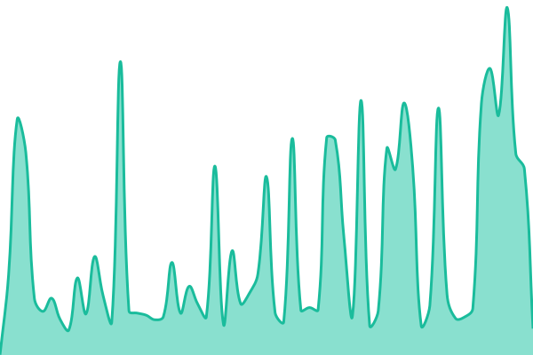
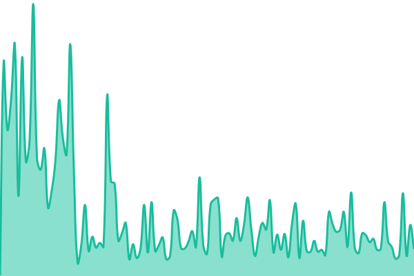
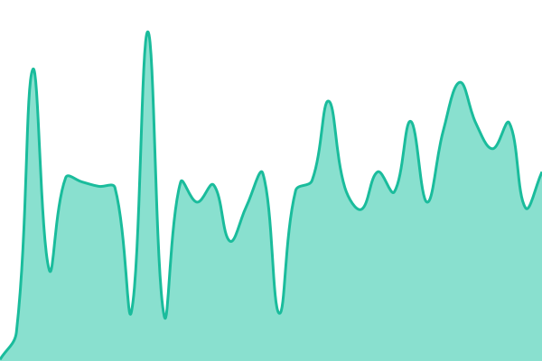
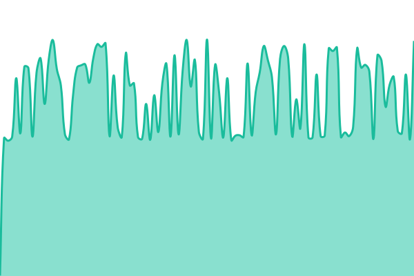

# [📈 Live Status](https://status.drayko.xyz): <!--live status--> **🟩 All systems operational**

This repository contains the open-source uptime monitor and status page for [ddrayko](https://codeberg.org/ddrayko), powered by [Upptime](https://github.com/upptime/upptime).

With [Upptime](https://upptime.js.org), you can get your own unlimited and free uptime monitor and status page, powered entirely by a GitHub repository. We use [Issues](https://github.com/ddrayko/status/issues) as incident reports, [Actions](https://github.com/ddrayko/status/actions) as uptime monitors, and [Pages](https://status.drayko.xyz) for the status page.

<!--start: status pages-->
<!-- This summary is generated by Upptime (https://github.com/upptime/upptime) -->
<!-- Do not edit this manually, your changes will be overwritten -->
<!-- prettier-ignore -->
| URL | Status | History | Response Time | Uptime |
| --- | ------ | ------- | ------------- | ------ |
|  [Portfolio](https://drayko.xyz) | 🟩 Up | [portfolio.yml](https://github.com/ddrayko/status/commits/HEAD/history/portfolio.yml) | 

 171ms
     
 | 

<a href="https://status.drayko.xyz/history/portfolio">100.00%</a>
    

|  [FlexURL](https://flexurl.link) | 🟩 Up | [flex-url.yml](https://github.com/ddrayko/status/commits/HEAD/history/flex-url.yml) | 

 381ms
     
 | 

<a href="https://status.drayko.xyz/history/flex-url">100.00%</a>
    

|  [ToolsBoxMachine (TBXM)](https://tbxm.drayko.xyz) | 🟩 Up | [tools-box-machine-tbxm.yml](https://github.com/ddrayko/status/commits/HEAD/history/tools-box-machine-tbxm.yml) | 

 161ms
     
 | 

<a href="https://status.drayko.xyz/history/tools-box-machine-tbxm">100.00%</a>
    

|  [ZeroHost](https://zero-host.org) | 🟩 Up | [zero-host.yml](https://github.com/ddrayko/status/commits/HEAD/history/zero-host.yml) | 

 124ms
     
 | 

<a href="https://status.drayko.xyz/history/zero-host">100.00%</a>
    

|  [DraykoSearch](https://search.drayko.xyz) | 🟩 Up | [drayko-search.yml](https://github.com/ddrayko/status/commits/HEAD/history/drayko-search.yml) | 

 374ms
     
 | 

<a href="https://status.drayko.xyz/history/drayko-search">100.00%</a>
    

<!--end: status pages-->

[**Visit our status website →**](https://status.drayko.xyz)

## 📄 License

- Powered by: [Upptime](https://github.com/upptime/upptime)
- Code: [MIT](./LICENSE) © [Anand Chowdhary](https://anandchowdhary.com)
- Data in the `./history` directory: [Open Database License](https://opendatacommons.org/licenses/odbl/1-0/)
